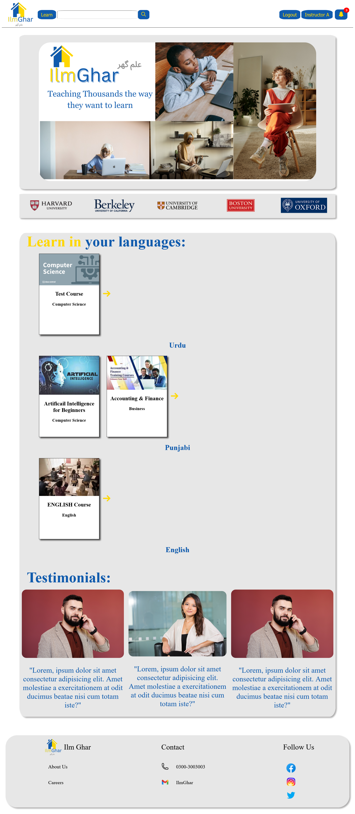
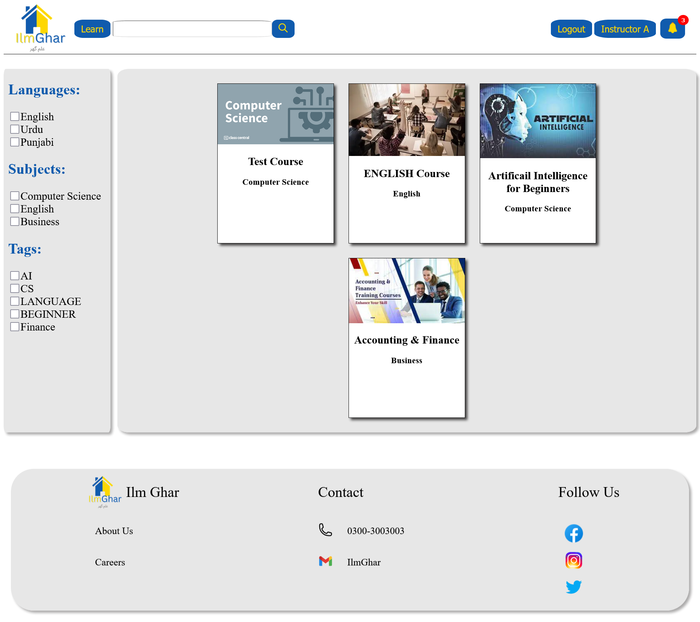
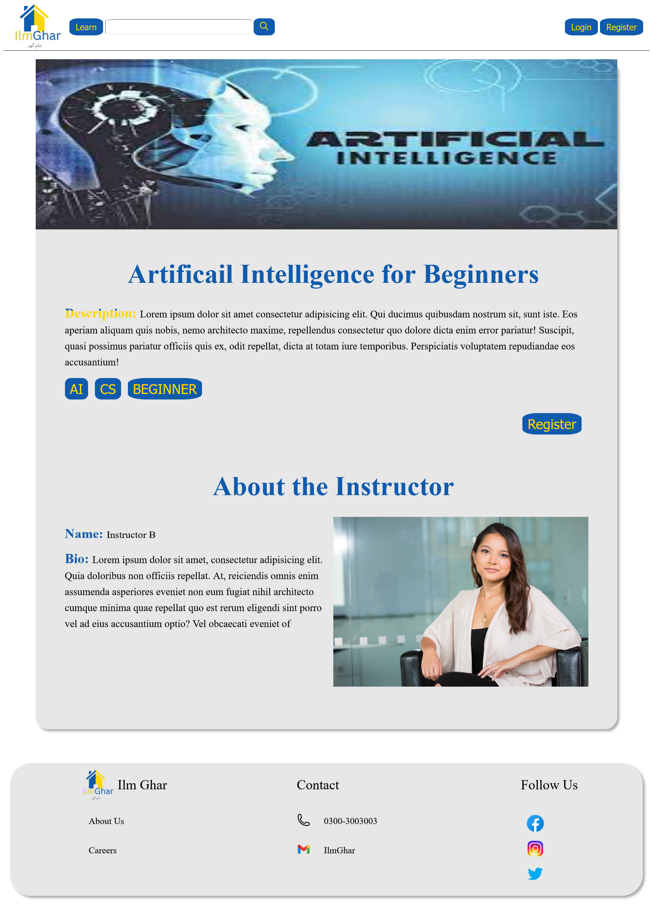
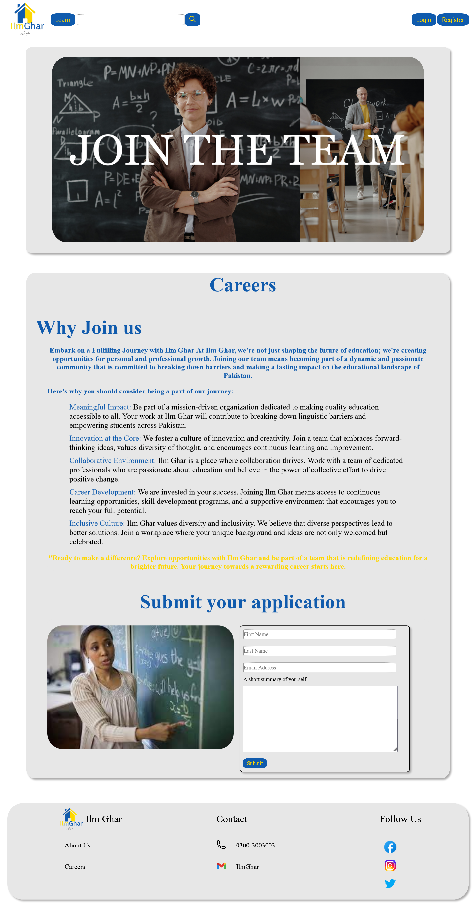
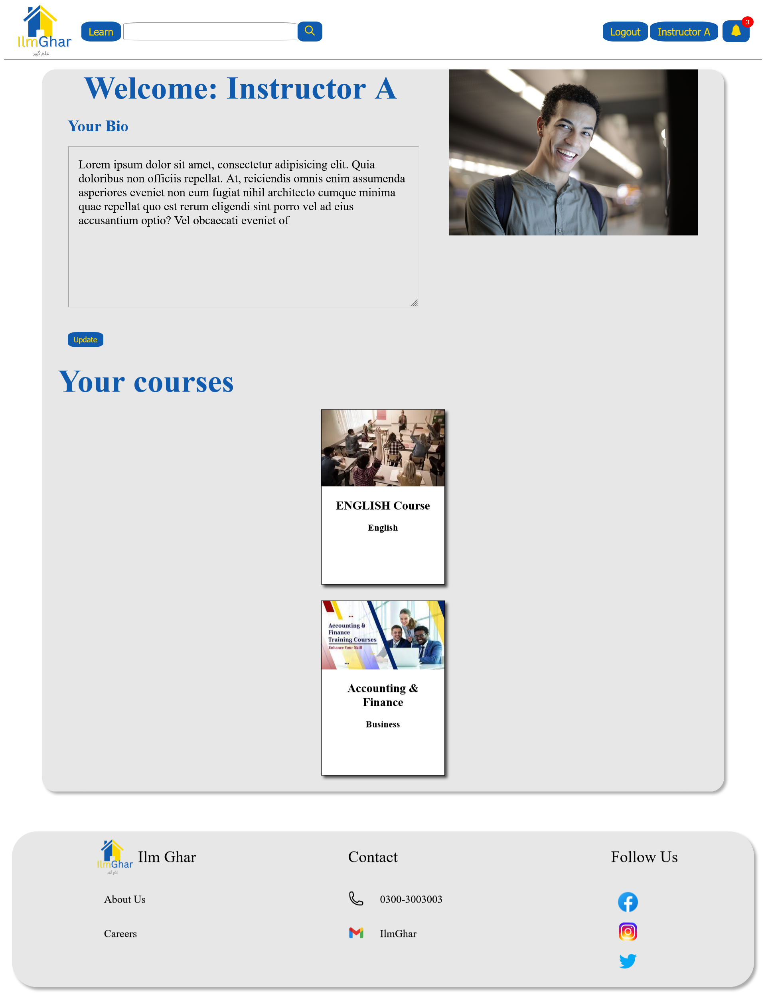
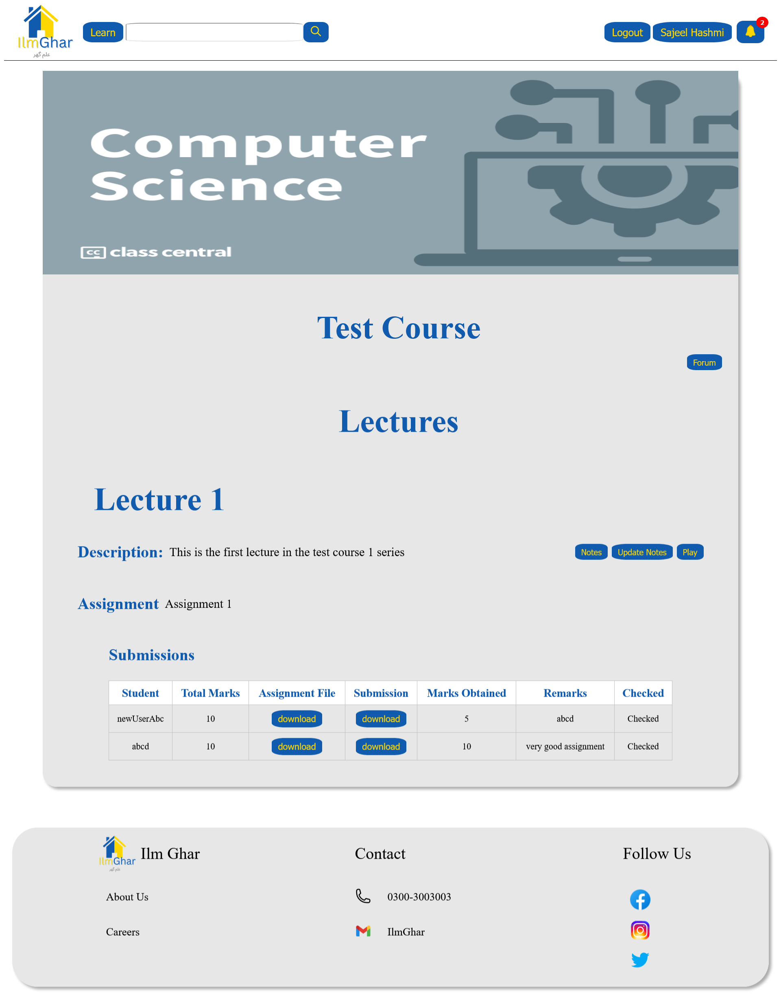
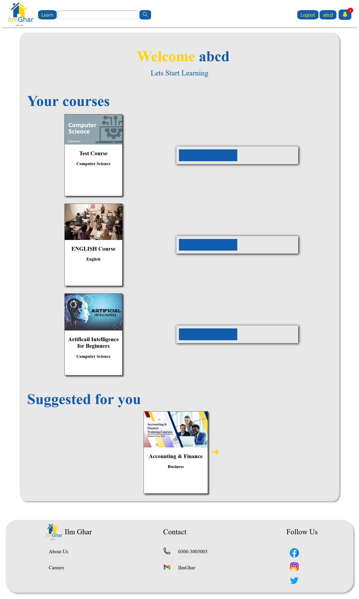
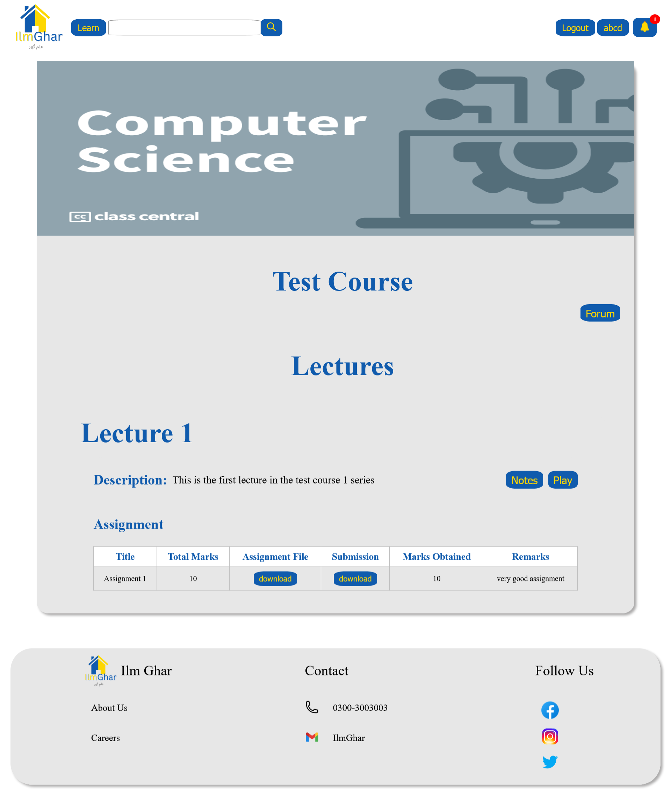
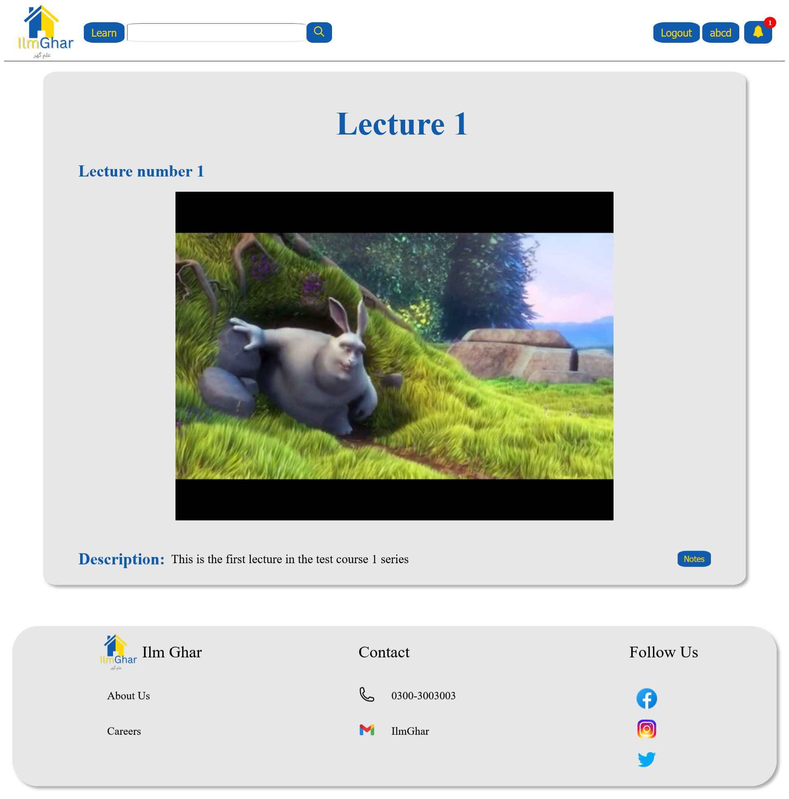

# Ilm Ghar

This is my semester project for the software engineering course. Ilm Ghar is an online education platform committed to providing the underprivileged with education in their native languages. It allows users to explore and filter courses, register accounts, enroll in courses to access lecture notes, assignments, forums, and enables instructors to manage their courses and more.

The application is developed using the RESTful approach, with Django as the backend and Vue.js for the frontend.

Following are some screenshots from the application.



<h1 style="text-align: center;"> Home page</h1>



<h1 style="text-align: center;"> Explore page</h1>



<h1 style="text-align: center;"> Course page</h1>


<h1 style="text-align: center;"> Course Forum</h1>



<h1 style="text-align: center;"> Careers page</h1>



<h1 style="text-align: center;"> Instructors Dashboard</h1>



<h1 style="text-align: center;"> Instructors Course View</h1>



<h1 style="text-align: center;"> Students Dashboard</h1>



<h1 style="text-align: center;"> Registered Course</h1>



<h1 style="text-align: center;"> Lecture</h1>

## Backend Setup

1. Clone the repository:

    ```bash
    git clone https://github.com/SajeelHashmi/E-learning-Django
    ```

2. Navigate to the project folder:

    ```bash
    cd E-learning-Django
    ```

3. Create a virtual environment:

    ```bash
    python -m venv venv
    ```

4. Activate the virtual environment:

    - On Windows:

        ```bash
        venv\Scripts\activate
        ```

    - On macOS/Linux:

        ```bash
        source venv/bin/activate
        ```

5. Navigate to the IlmGhar directory:

    ```bash
    cd IlmGhar
    ```

6. Install Python dependencies:

    ```bash
    pip install -r requirements.txt
    ```

7. Apply migrations:

    ```bash
    python manage.py migrate
    ```

8. Run the development server:

    ```bash
    python manage.py runserver
    ```

   The backend should now be running at [http://localhost:8000/](http://localhost:8000/).

## Frontend Setup

1. Navigate to the frontend folder:

    ```bash
    cd frontend
    ```

2. Initialize npm (if not already done):

    ```bash
    npm init
    ```

    Follow the prompts to create a `package.json` file.

3. Install frontend dependencies:

    ```bash
    npm install
    ```

4. Run the development server:

    ```bash
    npm start
    ```

   The frontend development server should now be running at [http://localhost:3000/](http://localhost:3000/).

## Important Note:

Create a superuser and use the Django admin area to register instructors and create courses with them. Each course will have some lectures, and every lecture will include a video, notes, and an assignment. We are using HLS to serve the lectures; currently, you need to manually create the HLS segments. After uploading a lecture, navigate to the media directory and run the following command:

```bash
ffmpeg -i lectureVideo.mp4 -c:v h264 -c:a aac -hls_time 10 -hls_list_size 0 lectureName_lectureId/output.m3u8
```
Remember to replace lectureVideo with the actual video name, lectureName with the lecture name, and lectureId with its ID.

Thank you.
